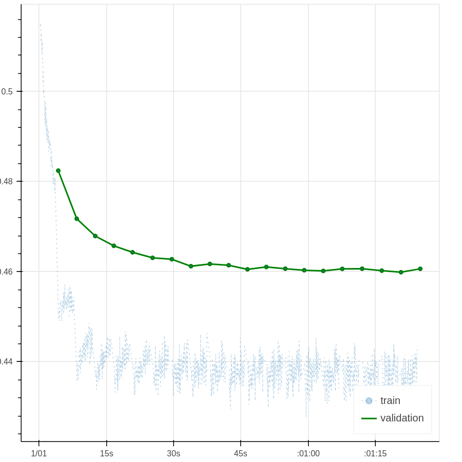
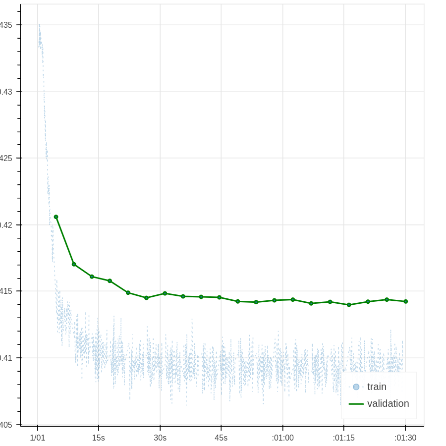

# beeva-poc-mxnet
Proof of Concept with MXNet and GPUs

## Experiments: recommender system based on MxNet examples

Based on [MxNet recommender examples](https://github.com/apache/incubator-mxnet/tree/master/example/recommenders)

More references:
- [MXNet for Collaborative Deep Learning in Recommender Systems](https://github.com/dmlc/mxnet-notebooks/blob/master/python/recommendation_systems/cdl/collaborative-dl.ipynb)
- [Gluon Intro to Recommender Systems](http://gluon.mxnet.io/chapter11_recommender-systems/intro-recommender-systems.html)

Note: we have to convert rating prediction examples to learning to rank approach.

### Tests
- Logistic Regression

```
def plain_net2(k):
    # input
    user = mx.symbol.Variable('user')
    item = mx.symbol.Variable('item')
    label = mx.symbol.Variable('score')
    # user feature lookup
    user = mx.symbol.Embedding(data = user, input_dim = max_user, output_dim = k)
    # item feature lookup
    item = mx.symbol.Embedding(data = item, input_dim = max_item, output_dim = k)
    # loss layer
    a = mx.symbol.L2Normalization(user)
    b = mx.symbol.L2Normalization(item)
    dot = a * b
    dot = mx.symbol.sum_axis(dot, axis=1)
    dot = mx.symbol.Flatten(dot)
    cosine = 1 - dot
    
    pred = mx.symbol.LogisticRegressionOutput(data=cosine, label=label)
    return pred
```
- CrossEntropy
```
def plain_net3(k):
    # input
    user = mx.symbol.Variable('user')
    item = mx.symbol.Variable('item')
    label = mx.symbol.Variable('score')
    # user feature lookup
    user = mx.symbol.Embedding(data = user, input_dim = max_user, output_dim = k)
    # item feature lookup
    item = mx.symbol.Embedding(data = item, input_dim = max_item, output_dim = k)
    # loss layer
    
    a = mx.symbol.L2Normalization(user)
    b = mx.symbol.L2Normalization(item)
    dot = a * b
    dot = mx.symbol.sum_axis(dot, axis=1)
    dot = mx.symbol.Flatten(dot)
    cosine = 1 - dot
    
    label = mx.symbol.Flatten(label)
    pred = mx.symbol.clip(cosine,0,1)
    pred = recotools.CrossEntropyLoss(data=pred, label=label)
    
    return pred
```
### Results:
- Original example:


- With LogisticRegressionOutput:



### Conclusions:
- MxNet examples are oriented to rating prediction
- CosineLoss is based on MAERegressionOutput
- LogisticRegressionOutput gets better RMSE than MAERegressionOutput

### Issues:
- MxNet output layers are not flexible to output probabilities. And this is required to apply crossentropy. [More info](https://github.com/apache/incubator-mxnet/issues/8807)
- softmax_cross_entropy raises error. [More info](https://github.com/apache/incubator-mxnet/pull/6766)
